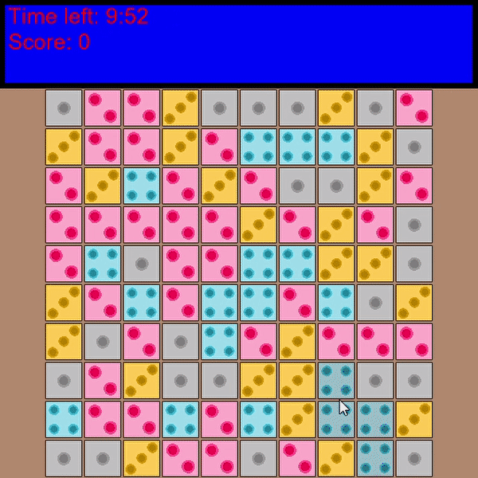

# "Tile Miner" game

[arc]: https://api.arcade.academy/en/latest/index.html
[v3]: https://store.steampowered.com/app/567640/Danganronpa_V3_Killing_Harmony/

This small game is written entirely in Python3 using the [arcade][arc] module, taking inspiration from the arcade
mini-game *TREASURE HUNTER! MONOLITH* from [Danganronpa V3][v3] (2017).

## Requirements

[np]: https://numpy.org/

You will need arcade (v2.5.7 or greater) and [Numpy][np].

## Game Summary

* The game starts with a collection of tiles numbered one to four, randomly arranged on a rectangular board. 
* The main objective is to **clear the board of as many tiles as possible**. 
* Tiles can only be removed if they neighbour other tiles with the same value. 
* The player receives points when they clear tiles and possibly bonus points if they manage to clear a group of at least 
five tiles. 
* When tiles get removed, the value of any bordering tiles are incremented by one. In the case of tiles with a maximum 
value of four, they reset back to a value of one. 
* The game ends if either no further moves are possible or the timer reaches zero.
* Before the game can begin, the player must provide the dimensions of the board and how much time they want. 

## Demonstration



## Version History

| Version   |Date       | Notes     |
|-----------|-----------|-----------| 
| 1.0      | 01-08-2021 | Initial version |

## Todo list

A list of things I would like to add/improve in future versions (if I ever get the time that is!):

* Improve the scoring system
* Add sprite animations
* Add new game modes
* Improve the overall presentation of the game (instead of using bland fonts and backgrounds)
* Replace the current images used with high-quality ones
* Fix any minor bugs that may still be present

## Misc.

[1]: https://api.arcade.academy/en/latest/examples/array_backed_grid_sprites_2.html?highlight=grid
[2]: https://api.arcade.academy/en/latest/tutorials/views/index.html?highlight=views
[3]: https://github.com/pythonarcade/arcade/tree/development/arcade/resources/gui_basic_assets

Coding references used for this project:

* [Grid Using Sprites v2][1]
* [Using Views for Start/End Screens][2]
* the [normal](./images/red_button_normal.png), [hover](./images/red_button_hover.png) and 
[press](./images/red_button_press.png) button images were taken from the [```resources/```][3] folder of the arcade module

All code in this repository was written solely by me. If you would like to fork and build upon this code, by all means 
go ahead; my only request is that you please acknowledge the original work.